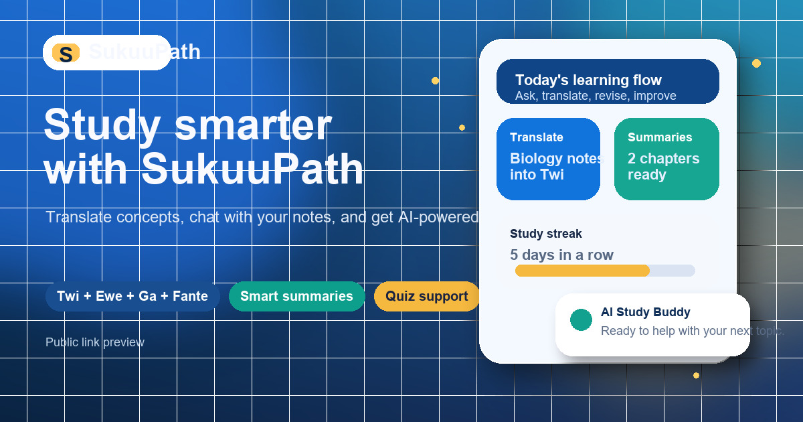

# SukuuPath GH

<p align="center">
  
</p>

<p align="center">
  
</p>

<p align="center">
  <a href="https://sukuupath-gh.vercel.app/"></a>
  <a href="https://github.com/Lanor-Jephthah1/sukuupath-gh"></a>
</p>

<p align="center">
  
  
  
  
  
</p>

<p align="center">
  SukuuPath GH is a full-stack academic intelligence platform designed for Ghanaian tertiary education.
  It helps students and lecturers translate learning materials, simplify difficult concepts, generate quizzes,
  summarize course content, upload resources, and interact with documents through a unified AI experience.
</p>

---

## Live Demonstration

**Production URL:** `https://sukuupath-gh.vercel.app/`

<p align="center">
  
</p>

### Demo Focus For Presentation

- Multi-tool academic assistant tailored to Ghanaian higher education workflows.
- English-to-local-language translation experience powered by the Ghana NLP Khaya API.
- AI summarization, quiz generation, simplification, and document chat in one product surface.
- Lecturer-facing material management plus feedback and audit visibility.
- Public production deployment with a full frontend and backend on a single domain.

---

## Problem Statement

Many students in higher education encounter a language and comprehension gap between formal academic material and the way they naturally process ideas. SukuuPath GH addresses that challenge by combining translation, summarization, question answering, and revision tooling into one system that is culturally and academically relevant.

This project is especially valuable in contexts where:

- students need clearer explanations of technical material
- local-language support improves comprehension and confidence
- lecturers need digital distribution and review workflows
- educational AI must remain observable, reviewable, and usable in real study scenarios

---

## Core Product Modules

### Student Experience

- `Translation Workspace` for academic translation between English and major Ghanaian languages.
- `Simplify Workspace` for reducing academic jargon into clearer explanations.
- `Summarizer` for study notes, revision bullets, brief summaries, and exam-prep content.
- `Quiz Generator` for MCQ, True/False, and short-answer assessments from source material.
- `AI Chat` for guided academic support conversations.
- `Document Chat` for asking questions against extracted document content.
- `Library` for saved outputs and study artifacts.
- `Dashboard` for usage activity, insights, and recent academic actions.

### Lecturer And Oversight Experience

- `Material Uploads` for PDFs, DOCX, PPTX, and related teaching materials.
- `Lecturer Dashboard` for resource management and quick monitoring.
- `Feedback Pipeline` for collecting trust and quality signals on AI outputs.
- `Audit Dashboard` for reviewing recent feedback, quality categories, and resolution flow.

---

## System Architecture

```mermaid
flowchart LR
    A[React + Vite Frontend] --> B[/api/* on FastAPI]
    B --> C[Khaya Translation API]
    B --> D[NextToken LLM Gateway]
    B --> E[Hugging Face Translation Models]
    B --> F[Firebase Realtime Database]
    B --> G[Firebase Auth Client + Admin Credentials]
    B --> H[SQLAlchemy Runtime Database Layer]
    I[Vercel Static Hosting] --> A
    J[Vercel Python Runtime] --> B
```

### Frontend Layer

- Built with React and Vite.
- Handles onboarding, authentication flows, dashboards, translation workspace, quiz generation, summaries, library management, and lecturer tools.
- Uses Firebase client configuration for sign-in flows and browser-side auth interactions.
- Communicates with the backend through `/api/*` routes on the same deployment domain.

### Backend Layer

- Built with FastAPI and exposed through `api/index.py` on Vercel.
- Centralizes business logic for translation, summaries, quizzes, chat, file extraction, material uploads, feedback capture, and study library persistence.
- Normalizes translation responses, computes confidence labels, and handles production-safe upload storage using `/tmp` on Vercel.

### Data Layer

- Firebase Realtime Database stores users, study items, lecturer materials, and feedback streams.
- Firebase Admin credentials are loaded securely through `FIREBASE_SERVICE_ACCOUNT_JSON` in production.
- SQLAlchemy is configured for SQLite fallback or hosted `DATABASE_URL` support where structured persistence is needed.

### Deployment Layer

- Vercel statically serves the frontend build.
- Vercel Python runtime serves the FastAPI backend.
- `vercel.json` routes `/api/*` into the backend and sends all other app routes to the frontend SPA entrypoint.

---

## Translation Architecture: Khaya AI Pipeline

One of the most important parts of SukuuPath GH is the translation stack, because it is central to the product story and the conference demonstration.

### Translation Request Flow

1. A user submits source text in the Translation Workspace.
2. The frontend sends the payload to `POST /api/ai/translate`.
3. The FastAPI backend maps the language pair into the expected Ghana NLP format.
4. The backend calls the official Khaya translation endpoint:
   `https://translation-api.ghananlp.org/v2/translate`
5. The translated response is normalized and repaired for encoding issues before it is returned to the client.
6. If direct hosted translation is configured differently, the backend can switch to Hugging Face.
7. If direct translation fails or a pair is unsupported in the current path, the backend falls back to the NextToken-based translation prompt flow.

### Why This Matters

- It gives the system a real Ghana-focused translation backbone rather than a generic demo-only experience.
- It supports conference storytelling around localization, accessibility, and contextual learning.
- It demonstrates a practical hybrid AI architecture: specialized translation service first, broader LLM fallback second.

### Supported Translation Design

- English and major Ghanaian language support is handled through a backend language mapping strategy.
- The implementation is designed to support direct translation, hosted model routing, and fallback orchestration without changing the frontend UX.
- Unicode repair and confidence normalization make the output safer for student-facing delivery.

---

## AI Service Orchestration

SukuuPath GH is not a single-model application. It is an orchestrated educational AI stack where each component handles a different kind of academic workload.

### Khaya Translation API

- Used for localized academic translation.
- Best suited for direct language conversion in the translation workspace.
- Provides the strongest conference narrative around Ghanaian language technology.

### NextToken Gateway

- Powers chat, simplification, summarization, insight generation, and quiz creation.
- Used when the system needs flexible reasoning and response shaping.
- Supports structured JSON generation for quiz pipelines.

### Hugging Face Translation Path

- Available as an alternative hosted translation route when configured.
- Useful for model-routing experiments, hosted transformer deployment, or language-pair-specific swaps.

### Document Extraction Engine

- PDF extraction through `PyMuPDF`
- DOCX extraction through `python-docx`
- PPTX extraction through `python-pptx`
- Plain text decoding for simpler file uploads

This allows SukuuPath GH to treat documents as AI-ready study inputs rather than passive files.

---

## Data And Feature Flow

### Authentication

- Firebase client auth supports email/password and Google-based sign-in journeys.
- Backend profile routes support account updates, password changes, and profile persistence.
- Production domains are explicitly authorized for Firebase Auth.

### Study Library

- User actions such as summaries, quizzes, chats, and notes are written to local state first for immediate responsiveness.
- The backend sync path stores study items in Firebase Realtime Database.
- The dashboard reads these artifacts to compute activity, recent history, and study metrics.

### Lecturer Materials

- Uploaded teaching resources are stored with metadata including title, original filename, type, size, and creation timestamp.
- Materials can later support translation, review, and downstream study workflows.

### Feedback And Responsible AI

- Users can mark outputs as correct, unclear, wrong, offensive, or culturally inappropriate.
- Feedback is stored and surfaced in the audit dashboard.
- This creates a measurable trust loop instead of a black-box AI experience.

---

## Repository Structure

```text
.
|- api/                              # Vercel Python entrypoint
|- backend/                          # FastAPI app, Firebase integration, AI routes
|- frontend/                         # React + Vite application
|- training/                         # Model-preparation and translation research scripts
|- ghana_nlp_translation_datasets/   # Dataset assets for translation experimentation
|- vercel.json                       # Vercel routing and build definition
|- requirements.txt                  # Python dependencies used in deployment
```

### Deployment-Relevant Areas

- `frontend/` contains the client application.
- `backend/` contains the API and all academic AI workflows.
- `api/index.py` bridges Vercel to the backend app.
- `vercel.json` defines the final frontend/backend routing behavior.

### Research Areas

- `training/` and `ghana_nlp_translation_datasets/` support experimentation and model preparation.
- These folders are part of the broader project story, but the public production deployment is trimmed to the runtime essentials required for the site to function.

---

## Local Development

### Backend

```powershell
cd backend
python -m pip install -r requirements.txt
uvicorn main:app --reload --host 127.0.0.1 --port 8000
```

### Frontend

```powershell
cd frontend
npm install
npm run dev
```

### Required Environment Variables

#### Backend

| Variable | Purpose |
|---|---|
| `NEXTTOKEN_API_KEY` | Enables chat, summarize, simplify, quiz, and general AI workflows |
| `FIREBASE_DATABASE_URL` | Firebase Realtime Database URL |
| `FIREBASE_SERVICE_ACCOUNT_JSON` | Firebase Admin credentials for production |
| `DATABASE_URL` | Hosted SQL database connection when used |
| `TRANSLATION_PROVIDER` | Translation route selector |
| `HUGGINGFACE_API_TOKEN` | Hugging Face hosted inference auth |
| `HUGGINGFACE_TRANSLATION_MODEL` | Default hosted translation model |
| `HUGGINGFACE_TRANSLATION_MODEL_MAP` | Language-pair-to-model mapping JSON |

#### Frontend

| Variable | Purpose |
|---|---|
| `VITE_FIREBASE_API_KEY` | Firebase web client config |
| `VITE_FIREBASE_AUTH_DOMAIN` | Firebase web client config |
| `VITE_FIREBASE_PROJECT_ID` | Firebase web client config |
| `VITE_FIREBASE_STORAGE_BUCKET` | Firebase web client config |
| `VITE_FIREBASE_MESSAGING_SENDER_ID` | Firebase web client config |
| `VITE_FIREBASE_APP_ID` | Firebase web client config |
| `VITE_FIREBASE_MEASUREMENT_ID` | Firebase analytics config |

---

## Production Deployment

### Public Application

- `https://sukuupath-gh.vercel.app/`

### Source Repository

- `https://github.com/Lanor-Jephthah1/sukuupath-gh`

### Deployment Characteristics

- Single public domain for frontend and backend
- Vercel static frontend delivery
- Vercel serverless Python backend execution
- Firebase-powered persistence and authentication support
- Production-safe upload handling and public route aliasing

---

## Authors

Built by **Jephthah Lanor** and **Nicholas Baffoe**.

<p align="center">
  <strong>Built to make academic support more local, intelligent, and genuinely usable.</strong>
</p>
